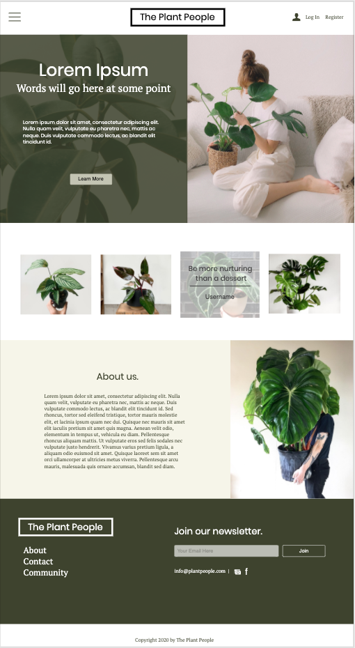
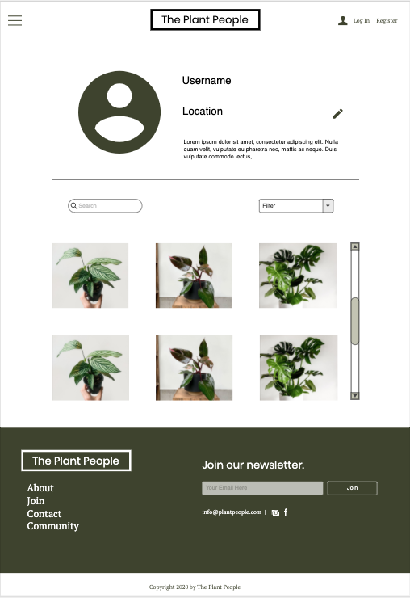
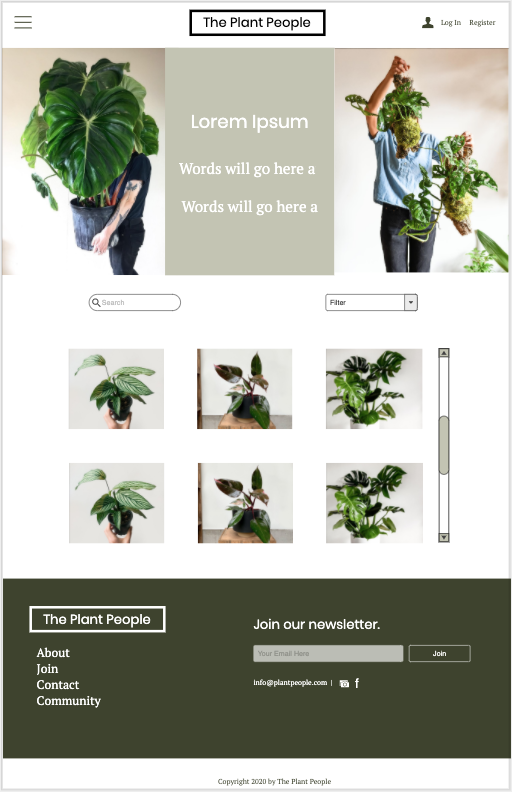
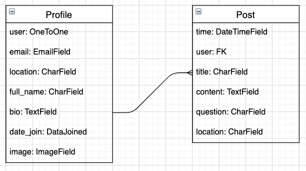

# plant-people
Capstone Project

# Description
The idea for Plant People came from trying to keep up with all of my Facebook plant groups. I thought, how cool would it be if all of these posts could be found and tracked in one place? Thus Plant People was born. Users are able to post simple posts as of right now that can be tied to their profile page.

# Technology Used
- Python
- Django
- postgreSQL
- Pillow
- JQuery
- Bootstrap
- Javascript

# Installation Steps
- pip3 install -r requirements.txt

# User Stories
TBD

# Wireframes
### Landing

### Profile

### Community

# entity relationship diagrams

### unsolved problems
- Friendly Errors

### future features
- Comments
- Public Profile
- Functional Search and Filter
- Mobile Friendly
- More post options